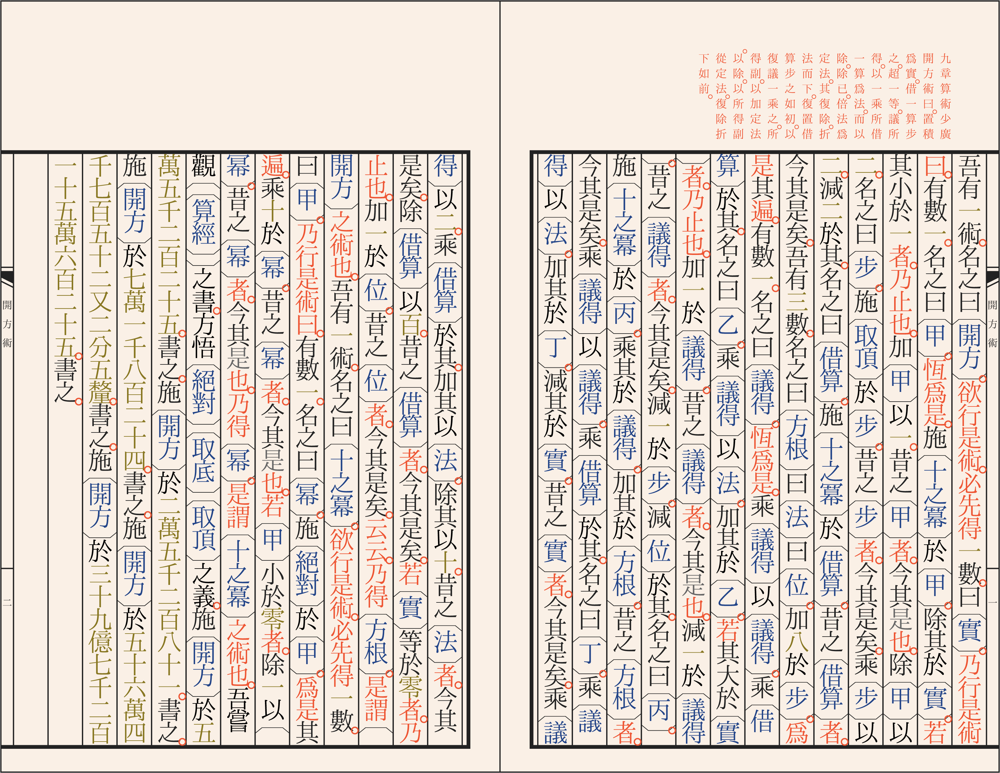

## Ancient Chinese Mathematical Algorithms in *Wenyan*

This repo includes implementations of a few ancient Chinese mathematical algorithms using [*wenyan*](https://github.com/LingDong-/wenyan-lang), an [esoteric programming language](https://en.wikipedia.org/wiki/Esoteric_programming_language) for the ancient Chinese.

- *Kaifangshu*/開方術 (calculation of square roots)
- *Gengxianjiansunshu*/更相減損術 (calculation of greatest common divisors)
- *Dayanqiuyishu*/大衍求一術 (calculation of modular inverse)

It's only for fun!

